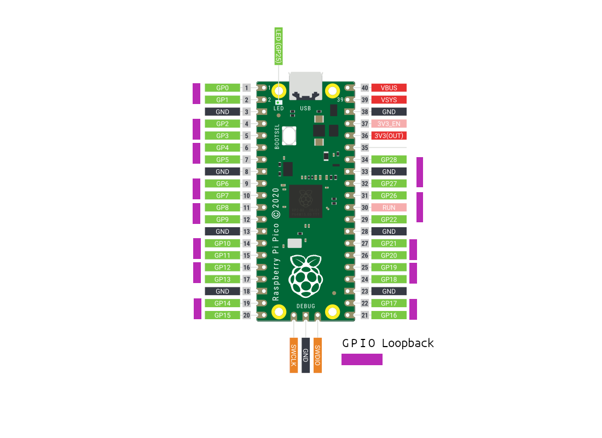

# Tests  {#TestsMainPage}

## Environment

To run those tests you need:

- One MQTT broker without any security activated on localhost:1883
- Plug the hardware configuration corresponding to the firmware tested

## Picoha IO firmware Validation

This section match the [features](features/io.feature) from the io firmware

To validate this firmware the following loopback connections must be set



## Dependencies

```bash
# Install from the github to get the lastest cool features
pip install git+https://github.com/behave/behave
# Install the html formater, for your bosses :-)
pip install behave-html-formatter
# Top Asserts !
pip install PyHamcrest
```

## Just run behave

This project is already prepared to be used like this. To check that your setup is correct, let's just run the project.

```bash
# just run the command behave
behave

# To get the html report
behave -f html -o report.html
```

